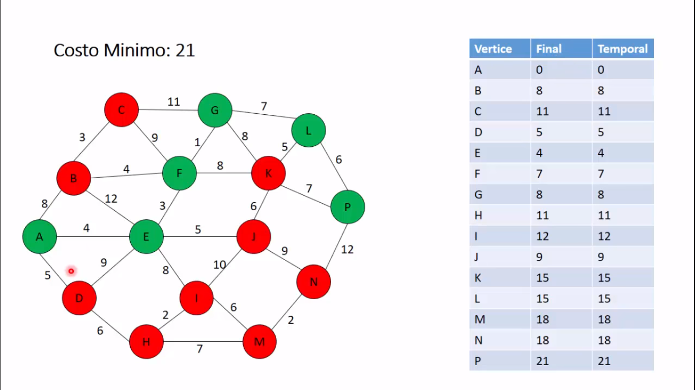

======================
Algoritmo de Dijkstra.
======================

Algoritmo de Dijkstra. También llamado algoritmo de caminos mínimos, es un algoritmo para la determinación del
camino más corto dado un vértice origen al resto de vértices en un grafo con pesos en cada arista.

Problema planteado sale a partir del siguiente grafo.

Lenguaje
========

* Java 1.8 Oracle.

Creditos
========

* Dikstra_.

.. _Dikstra: https://www.youtube.com/watch?v=4I7W5WUQQQI

Autor
=====
* Bonnier <pacifi.bnr@gmail.com> https://github.com/pacifi